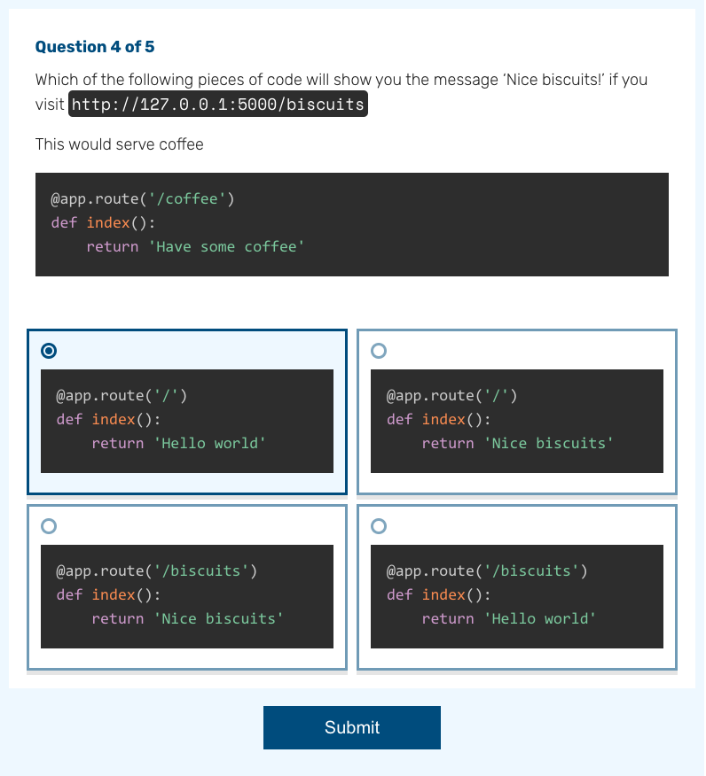
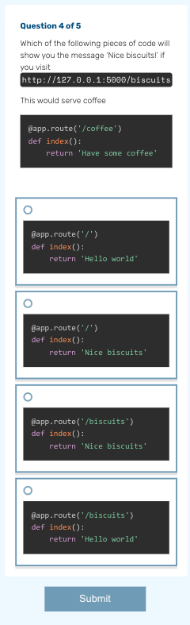
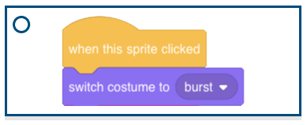

# knowledge-quiz-test

Find the project online at [projects.raspberrypi.org/en/projects/knowledge-quiz-test](https://projects.raspberrypi.org/en/projects/knowledge-quiz-test)

## Quiz guidelines

The quiz format has been designed to be extremely flexible. Any markdown used in the projects site should work in the quiz. Follow these guidelines to ensure your quiz looks its best.

## Desktop vs Mobile

On desktop, answers to the quiz questions will appear in a 2x2 grid. On mobile, they will appear in a single column.

 

## Quiz questions

Add any markdown you like in the quiz question area. Videos, gifs, Scratch blocks and more should all work in this area.

Try to keep the question relatively short vertically - in user testing young people struggled when they had to scroll between the question and the answers.

## Quiz answers

#### Text

Text is the simplest type of answer, and is guaranteed to look good on desktop and mobile.

#### Scratch blocks

Scratch blocks can be used in question answers, but will look best when you follow these guidelines

- Don't make your Scratch blocks too tall.
  - This makes it harder for the user to compare the answer to the question, as they will have to scroll down to see the answers.
- Don't make your Scratch blocks too wide.
  - This makes it harder to read the answers as the user will have to scroll horizontally.

#### Other
[Images of other buttons]

## Areas around the quiz

## Previewing your quiz

Make sure you preview your quiz in desktop and mobile view to check for any formatting issues.

## Problems?

Contact the digital team if you have any issues authoring your quiz.

## Resources
For project materials and solutions, see [en/resources](https://github.com/raspberrypilearning/knowledge-quiz-test/tree/master/en/resources) and [en/solutions](https://github.com/raspberrypilearning/knowledge-quiz-test/tree/master/en/solutions).

## Contributing
See [CONTRIBUTING.md](CONTRIBUTING.md)

## Licence
 See [LICENCE.md](LICENCE.md)
