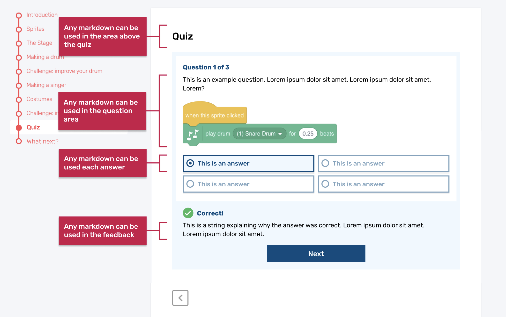
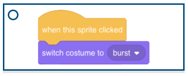
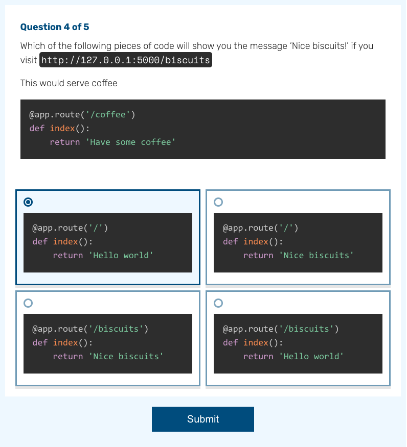
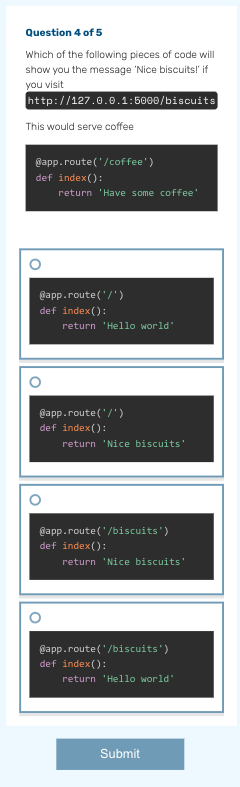

# knowledge-quiz-test

## Live quiz examples
Find the live quiz examples at [https://staging--rpf-projects-1e21fd.netlify.app/en/projects/knowledge-quiz-test/1](https://staging--rpf-projects-1e21fd.netlify.app/en/projects/knowledge-quiz-test/1)

See how these quiz questions were constructed by checking the files in [en/quiz1/][en/quiz1/] in this project.

## Quiz design guidelines
The quiz format has been designed to be extremely flexible. Any markdown used in the projects site should work in the quiz. Follow these guidelines to ensure your quiz looks its best.

The areas of the quiz are shown in the diagram below.

## Quiz questions
Add any markdown you like in the quiz question area. Videos, gifs, Scratch blocks and more should all work in this area.

## Quiz answer formats
### Scratch blocks

Scratch blocks can be used in question answers, but will look best when you follow these guidelines

- **Keep you Scratch blocks short.**
  - Tall blocks mean the user has to scroll up and down between the answers and the question.
- **Keep your Scratch blocks narrow.**
  - Wide blocks make the quiz area scroll horizontally, making it hard for users to read the answers.
  
### Other blocks

Text and python have been tested and work in question answers. Any markdown should work in an answer, let us know if you have tried something and the formatting looks strange.

## Quiz hints
When a user answers a question, they will be told if their answer is right or wrong, and given a hint, or further explanation. Any markdown can be used in this area.

## Desktop vs Mobile
On desktop, answers to the quiz questions will appear in a 2x2 grid. On mobile, they will appear in a single column.

**Desktop:**

**Mobile:**

Make sure you preview your quiz in desktop and mobile view to check for any formatting issues.

## Resources
For project materials and solutions, see [en/resources](https://github.com/raspberrypilearning/knowledge-quiz-test/tree/master/en/resources) and [en/solutions](https://github.com/raspberrypilearning/knowledge-quiz-test/tree/master/en/solutions).

## Contributing
See [CONTRIBUTING.md](CONTRIBUTING.md)

## Licence
 See [LICENCE.md](LICENCE.md)

## Note
Find the project online at [https://staging--rpf-projects-1e21fd.netlify.app/en/projects/knowledge-quiz-test](https://staging--rpf-projects-1e21fd.netlify.app/en/projects/knowledge-quiz-test)
